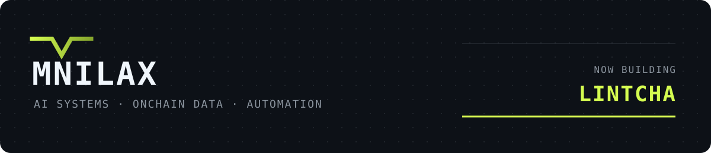

  

# hey, i'm mnilax.

I build small tools for things that are hard to inspect: AI agents, onchain data and automation.

> **now building: lintcha** 
> Tools that read first, show their boundaries and leave the verdict to you.

## current work

### [lintcha chain](https://github.com/Mnilax/lintcha-chain)

Reads what a Robinhood Chain launch calls itself and shows which of those self-declared strings also appear in the published snapshot. No score. No verdict.

[open the tool](https://chain.lintcha.com) · [live launches](https://chain.lintcha.com/live/) · [telegram mini app](https://t.me/lintchabot) · [source](https://github.com/Mnilax/lintcha-chain)

### [lintcha](https://github.com/Mnilax/lintcha)

Paste an AI-agent profile. See what it already states, which questions remain unanswered, and get missing lines ready to copy.

[try it](https://lintcha.com) · [source](https://github.com/Mnilax/lintcha)

## toolbox

`Python` · `JavaScript` · `TypeScript` · `Node.js` 
`Cloudflare Workers` · `Telegram Bot API` · `MCP` · `GitHub Actions`

I like tools that are small enough to understand, useful enough to keep open, and honest about what they don't know.

[@mnilax](https://x.com/mnilax)
